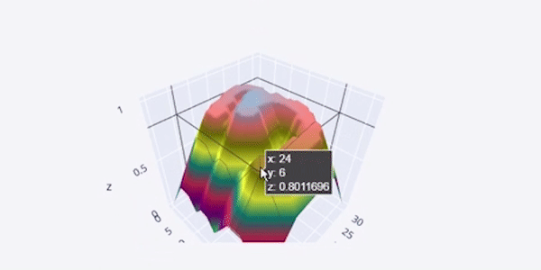

# Image Feature Extraction
<h3>Image-Feature-extraction-using-Reinforcement-Learning.</h3>
<h4>Our algorithm converts an image dataset into tabular dataset by extracting features of image using reinforcement leanring.</h4>

<h2>Demo :-</h1>

## Procedure: 
 * Calculate transition matrix of an Image
 * Preprocess it to reduce computation
 * Assign pixels to grids
 * Assign reward to each state
 * Find center of figure
 * Calculate features
 * At the end we get 4 features corresponding to each image
