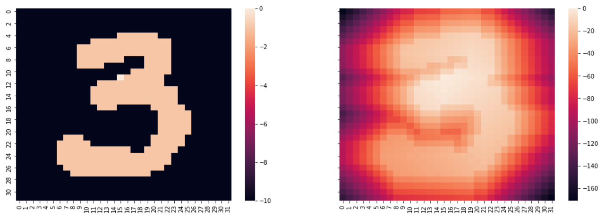

# Image Feature Extraction
<h3>Image-Feature-extraction-using-Reinforcement-Learning.</h3>

**Our algorithm converts an `image dataset` into `tabular dataset` by extracting features of an image. 
 This algorithm is tested on simple problems like `handwritten-digit recognition`, `hand-sign recognition` etc and is able to extract features. 
 For complex problems like extracting features from a human face image, we have not tested it yet and it probably won't work due to complexity of the problem.**

<h2>Demo :-</h1>
Input:

    

Output: `-169.0` , `-148.0`, `-153.0`, `-171.0`

## Algorithm [approach]: 
 * Preprocess image to reduce computation
 * Calculate transition matrix of the preprocessed Image
 * Assign pixels to grids
 * Assign reward to each state
 * Find optimal point of the figure
 * Calculate return 
 * Use it to extract features
 * At the end we get a set of 4 features corresponding to each image

Inference Notebook link: https://www.kaggle.com/raj401/image-feature-extraction-using-rl
## Theory

Theory Notebook link: https://colab.research.google.com/drive/1ttKeYIf_TUjrm9HPu8U5_PRI2A7Vi6s9?usp=sharing
